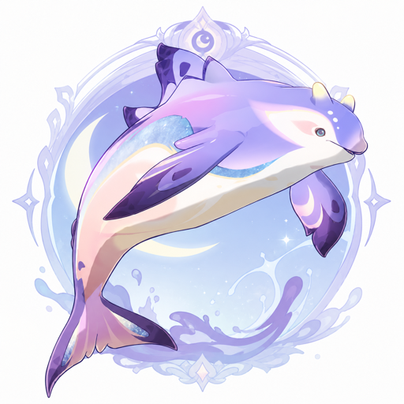
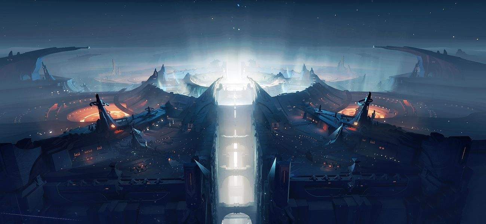

<p align="center"></p>

# dsh-frostfin (Moonglow Frostfin Whale): Kimi Code as DSH Agent Loop

English | [中文](README.md)

> "A wondrous aquatic creature altered by the influence of kuuvahki." — in-game archive entry, Moonglow Frostfin Whale

<p align="center"></p>

**Kimi Code's brain, DeepSeek Harness's body.**

frostfin is a DSH loop plugin: it replaces the driver of a DSH session wholesale with **Kimi Code itself** — connected directly over ACP (Agent Client Protocol), with no second agent paraphrasing in between. You get two things that used to be mutually exclusive:

- **From Kimi**: Kimi Code's own agent loop — planning, tool orchestration and thinking modes tuned for the kimi-for-coding model family. Not a single component is replaced, and upgrades ride along;
- **From DSH**: the entire ecosystem — Web UI, themes, session management, trajectory view, community plugins, and the Cordis substrate where "everything is a plugin, and every plugin is revertible".

The strengths of both, in one project.

## The name

**Layer one: the whale and the moon.** DeepSeek's totem is a whale; Moonshot AI's Chinese name (月之暗面, "the dark side of the moon") comes from Pink Floyd's album *The Dark Side of the Moon*. What this plugin does, literally, is: let DeepSeek's whale be transformed by the power of the moon.

**Layer two: the Frostfin Whale actually exists — in Genshin Impact.** The base species is a whale from the seas of Nod-Krai, added to the bestiary in version 6.0 "Luna I"[^1][^2], and it breached the surface in that chapter's main-story cutscene[^6]. Version 6.7 "Luna VIII" (July 2026) introduced its lunar variant — the **Moonglow Frostfin Whale**[^3], whose habitat the in-game bestiary places on the moon map "Frost Moon", with the entry: "A wondrous aquatic creature altered by the influence of kuuvahki."[^4] (*Kuuvahki* — 月矩力 — is the moon's power in Nod-Krai lore.) An ordinary aquatic creature, altered by the moon's power — we scoured the dictionary and found no more precise metaphor: **the whale is still that whale, the sea is still that sea — but the tides now answer to the moon.**

**Layer three: the easter egg closes the loop.** On the far side of "Frost Moon", the Moonglow Frostfin Whale's home map, lies the region "Dark Side of the Moon" — both arrived in the same 6.7 "Luna VIII" release[^3][^5]. Light up that region's map and the achievement that pops is called "Any Colour You Like"[^5] — a track on *The Dark Side of the Moon*. The joke miHoYo buried and the source of Moonshot AI's company name are the same 1973 record. Three chains of tribute, closing a loop half a century back.

<p align="center"></p>

<p align="center">
  
  
  <br>
  <sub>Frostfin Whale (base species · Nod-Krai) ｜ Pink Frostfin Whale (shiny variant) ｜ Moonglow Frostfin Whale (altered by kuuvahki · Frost Moon)<br>Artwork from Genshin Impact's in-game bestiary, © miHoYo — shown here only to illustrate the name's origin</sub>
</p>

The bestiary also records a folk saying from Nod-Krai: **"anyone who sees a pink Frostfin Whale will have their wish come true."**[^4] May everyone who installs this plugin have their wish come true.

**On precision**: "altered by the influence of kuuvahki" describes the lunar variant, not the base species — so the full brand is **Moonglow Frostfin Whale**, the entry's true owner; the package name `dsh-frostfin` keeps the family name: short, searchable, early in the alphabet.

<details>
<summary>Runner-up names (each had its merits)</summary>

<p align="center"></p>

- `dsh-moontide` — moon pulls the tides, tides carry the whale; we later learned 6.7's moon map really does have a sea called the Moontide Sea[^5]
- `dsh-moonwhale` — the two mascots fused directly; the most literal
- `dsh-moonsea` — real astronomical term for a lunar mare on the far side; the grandest
</details>

[^1]: [Bestiary: Frostfin Whale · Bilibili Genshin Wiki](https://wiki.biligame.com/ys/%E7%94%9F%E7%89%A9%E5%BF%97%EF%BC%9A%E9%9C%9C%E9%B3%8D%E9%B2%B8) (habitat: Nod-Krai; introduced in Luna I)
[^2]: ["Luna I" version update notes (official, full text) · Bilibili Genshin Wiki](https://wiki.biligame.com/ys/%E3%80%8C%E6%9C%88%E4%B9%8B%E4%B8%80%E3%80%8D%E7%89%88%E6%9C%AC%E3%80%8C%E3%80%8E%E7%A9%BA%E6%9C%88%E4%B9%8B%E6%AD%8C%C2%B7%E5%91%88%E7%A4%BA%E3%80%8F%E9%9B%AA%E6%B5%AA%E4%B8%8E%E8%8B%8D%E6%9E%97%E4%B9%8B%E8%88%9E%E3%80%8D%E6%9B%B4%E6%96%B0%E4%B8%93%E9%A2%98) (entry 9: new wildlife includes the Frostfin Whale)
[^3]: ["Luna VIII" version update notes (official, full text) · Bilibili Genshin Wiki](https://wiki.biligame.com/ys/%E3%80%8C%E6%9C%88%E4%B9%8B%E5%85%AB%E3%80%8D%E7%89%88%E6%9C%AC%E3%80%8C%E3%80%8E%E7%A9%BA%E6%9C%88%E4%B9%8B%E6%AD%8C%C2%B7%E8%B0%90%E8%B0%A5%E3%80%8F%E6%98%A0%E5%A4%8F%EF%BC%81%E5%BD%92%E4%B9%A1%EF%BC%9F%E5%8D%83%E7%81%B5%E8%8A%82%EF%BC%81%E3%80%8D%E6%9B%B4%E6%96%B0%E4%B8%93%E9%A2%98) (entry 8: new wildlife — the Moonglow Frostfin Whale)
[^4]: [Bestiary: Moonglow Frostfin Whale · Bilibili Genshin Wiki](https://wiki.biligame.com/ys/%E7%94%9F%E7%89%A9%E5%BF%97%EF%BC%9A%E6%9C%88%E8%8A%92%E9%9C%9C%E9%B3%8D%E9%B2%B8) (habitat: Frost Moon; introduced in Luna VIII; source of the pink-whale folk saying)
[^5]: [Achievement set "Unfettered Crescent" · Bilibili Genshin Wiki](https://wiki.biligame.com/ys/%E6%97%A0%E6%9D%9F%E7%9A%84%E6%AE%8B%E6%9C%88) (the achievement "Any Colour You Like": "Light up the Dark Side of the Moon map"; the same set mentions the Moontide Sea in several entries)
[^6]: [Archon Quest "Where the Moon Rises" · Bilibili Genshin Wiki](https://wiki.biligame.com/ys/%E6%9C%88%E4%BA%AE%E5%8D%87%E8%B5%B7%E7%9A%84%E5%9C%B0%E6%96%B9) (cutscene line: "a Frostfin Whale breaches the surface")

## How it works

```
you ──► DSH Web UI (themes / ecosystem / session management / approvals)
          │  session events
    frostfin (a DSH plugin occupying the agent-loop slot)
          │  ACP (JSON-RPC over stdio)
    kimi acp subprocess ── all thinking, tool calls, replies
```

In DSH's architecture the agent loop itself is a replaceable plugin (`ctx.agents.setFactory`). frostfin registers its own factory, bridges every DSH session to a `kimi acp` subprocess, and translates the ACP event stream into DSH session events in real time — so typewriter-effect streaming, history replay, and approval dialogs are all native DSH experiences.

**How this differs from existing approaches**: projects like kimi-tide attach Kimi at the model or tool layer — DSH's main loop is unchanged and Kimi is the object being called; frostfin swaps the loop itself for Kimi Code — the one you're talking to in DSH **is** kimi.

## Features

Every item below is covered by automated tests (unit + end-to-end, without the real kimi) and verified in a real browser:

- **Loop bridge**: DSH sessions driven by a `kimi acp` subprocess — streaming replies, thinking blocks, tool calls and plan blocks all render natively in DSH, with turn/step event discipline aligned to the native loop event-for-event
- **Approval bridge**: kimi's tool approval requests land on DSH's native approval dialog (first in the ecosystem) — the dialog's command preview lines up with the tool card's callId, and "allow" grants exactly that one call
- **Question channel**: kimi's AskUserQuestion pops a plugin-built multiple-choice modal — ACP has no question RPC, so kimi reuses the permission channel for questions, but DSH's approval dialog can't return *which* option was picked; questions therefore get their own path, independent of the permission policy. Skip/cancel maps to kimi's "user didn't answer" semantics — answers are never fabricated
- **Image input**: paste an image into the composer and it truly reaches kimi (bytes read from DSH's attachment store → base64 → ACP image block; kimi gates formats and compresses). If the bytes can't be read, a text placeholder stands in — images are never silently dropped
- **Session lifecycle**: resume across DSH restarts, self-healing kimi process crashes (the next prompt reconnects), attach any existing kimi session (`/frostfin-attach` or one click in the "Moonglow Frostfin Whale" tab, history replayed into the DSH log); permission mode and thinking level are remembered per kimi session and replayed automatically after a process restart
- **Mode dispatch**: adds the "Moonglow Frostfin Whale" mode and makes it the default — it runs on kimi, the standard mode runs the native loop, and neither disturbs the other; once a session is created, its driver is locked in and never silently swapped
- **Model layer**: the model selector shows kimi's real model list and selecting switches live; models configured in DSH (e.g. DeepSeek) are synced into kimi's config automatically, so kimi can run them directly
- **Status bar & slash commands**: the dock below the composer shows kimi's model / thinking level / permission mode / context usage / cwd & git branch in real time; `/frostfin-mode`, `/frostfin-thinking`, `/frostfin-plan`, `/yolo`, `/auto` switch directly; kimi's built-in `/compact` `/status` `/usage` `/mcp` `/tasks` `/help` pass through and execute as-is; in the command menu, plugin commands carry a `[frostfin]` tag and kimi commands a `[kimi]` tag, instantly distinguishable from DSH host commands
- **Goal & plan**: DSH's `/goal` drives kimi sessions (a host-level turn driver; the card can pause/edit/delete); kimi's plan mode works via `/frostfin-mode plan` (engine-enforced read-only, not a prompt convention)
- **Revertibility**: uninstalling undoes every registration (including the managed block synced into kimi's `config.toml` — your kimi config is restored verbatim); session bindings and the model cache under `~/.frostfin/` are deliberately kept so a reinstall picks up where you left off — to wipe them: `rm -rf ~/.frostfin`

## Which permission mode matters

In frostfin sessions you only need to care about **kimi's permission mode** (`/frostfin-mode <default|plan|auto|yolo>`; shortcuts `/yolo`, `/auto`, `/frostfin-plan`). The two DSH-side switches can mostly be ignored, with one exception each:

- The composer's "Workspace Write" selector bounds DSH's *native* tools; kimi's tools run in kimi's own process, out of that sandbox's reach. **Which to pick**: stay on the default workspace-write (read-only is equally harmless — both are no-ops for kimi); **the only one to avoid is danger-full-access** — it sets the session's approval policy to `never`, injects an English policy notice into kimi's conversation, and, when the plugin is configured with `permission: 'ask'`, auto-rejects every subsequent approval request (no dialog ever appears).
- DSH's approval policy (ask / never) only enters the answer chain when the plugin is configured with `permission: 'ask'`. Precision on the kimi side: auto mode self-approves everything (AskUserQuestion is even denied by the engine); yolo self-approves almost everything, but accesses to sensitive files (.env, SSH keys, credentials) and git control directories **still prompt** — those two ask policies run ahead of yolo's auto-approve in the chain.

Likewise, DSH's `/plan` only works for native-loop sessions (a prompt convention kimi never sees); for kimi sessions use `/frostfin-plan` — engine-enforced read-only: with plan mode active, kimi's permission policy chain denies Write/Edit and other mutating tools outright (the plan file excepted), regardless of what the model wants.

**Which to pick**:

- **Daily development: `/yolo`** — self-approves almost everything, and only interrupts you for .env, SSH keys, credentials, and git control directories. Lowest friction with the safety net intact; the mode is remembered per session and survives DSH restarts.
- **Review every step: `default`** — every mutating tool pops a dialog. Note DSH's dialog only offers allow/reject — it can't express kimi's "approve for this session", so similar tools will ask each time; if that gets noisy, go back to yolo.
- **Plan without touching anything: `/frostfin-plan`** — engine-enforced read-only; the plan is presented for your approval.
- **Unattended runs: `/auto`** — self-approves everything and even denies the question tool (it won't bother you); pairs best with DSH's `/goal` for long-running tasks. Don't expose sensitive directories to it.

## Installation

### 1. Install Kimi Code and log in

macOS / Linux (official script, no Node.js required):

```sh
curl -fsSL https://code.kimi.com/kimi-code/install.sh | bash
```

Windows (PowerShell; install [Git for Windows](https://gitforwindows.org/) before first launch — kimi uses the bundled Git Bash as its shell environment):

```powershell
irm https://code.kimi.com/kimi-code/install.ps1 | iex
```

Then run `kimi` once and log in with `/login` inside the TUI (Kimi Code OAuth or a Moonshot AI Open Platform API key). frostfin drives kimi through the `kimi acp` subprocess and reuses that login — no extra configuration.

### 2. Install DSH

Requires Node.js ≥ 22.19:

```sh
npx @deepseek-ai/dsh web   # Web UI defaults to http://127.0.0.1:3080
```

Pinned version: `@deepseek-ai/dsh@0.1.0-rc.x` (see "Status" below).

### 3. Install this plugin

```sh
# Clone and build
git clone https://github.com/pzc2004/dsh-frostfin.git
cd dsh-frostfin && pnpm install && pnpm build

# Add it to DSH's web profile
npx @deepseek-ai/dsh plugin --profile web add /path/to/dsh-frostfin

# Restart dsh web to take effect
npx @deepseek-ai/dsh web
```

Once installed: the new "Moonglow Frostfin Whale" mode becomes the default automatically; the conversation view gains a "月芒霜鳍鲸" tab (a list of local kimi sessions with one-click attach); no model configuration is needed — DSH's model gate is satisfied by a nominal route. **The full feature guide (panel / remote / commands / permission modes / FAQ) lives at [docs/guide.md](docs/guide.md) (Chinese).**

**Want headless too**: `npx @deepseek-ai/dsh plugin --profile headless add /path/to/dsh-frostfin`

**Uninstall**: `npx @deepseek-ai/dsh plugin --profile web remove dsh-frostfin` — uninstalling reverts every registration and removes the managed block synced into kimi's `config.toml` (your kimi config is restored verbatim). Session bindings and the model cache under `~/.frostfin/` are kept so a reinstall can resume; to wipe them completely, `rm -rf ~/.frostfin`.

## Platform support

Fully developed and verified on macOS. Linux should behave identically (POSIX semantics are home turf). **Windows is unverified**: the known prerequisite is that Kimi Code itself needs Git Bash (`KIMI_SHELL_PATH` can point to it); the remaining risk points (process-termination semantics, host module resolution) await real testing — feedback from Windows users is welcome.

## Roadmap

- ~~Remote kimi sessions~~ (**shipped**): Kimi Code sessions on servers are now managed from your local DSH — hosts are listed from `~/.ssh/config` (same semantics as VS Code), one click brings up a remote `kimi acp` over ssh+tmux (disconnects and local shutdowns never kill the remote process; reconnects resume the very same session); remote sessions are shown as host → workspace → session with one-click attach. Prerequisites: tmux and kimi on the server with `/login` done (the panel tells you exactly what's missing).
- **Next candidates**: ControlMaster connection reuse, remote state in the status dock, upstream asks for kimi ACP and DSH (see [docs/upstream-kimi-acp.md](docs/upstream-kimi-acp.md) and [docs/upstream-dsh.md](docs/upstream-dsh.md)).

## Status

Usable but early. Quality baseline: 58 automated tests (pure translation unit tests + end-to-end runs driving a scripted ACP child process, without the real kimi) plus real-browser verification (streaming replies, approval dialog, question modal, image understanding, status bar, slash commands). Pinned to `@deepseek-ai/dsh@0.1.0-rc.6` and Kimi Code 0.36.x — both sides iterate fast, so treat upgrades as deliberate actions. See the design doc at [docs/design-v0.1.md](docs/design-v0.1.md) (written in the M1–M3 era; implementation notes for M4+ live in code comments).

## License

The code is released under [MIT](LICENSE). The Genshin Impact-related artwork in `assets/` and in this document (bestiary images, map and region photos; the logo is a derivative work based on the in-game creature design) is © miHoYo / HoYoverse, shown only to illustrate the name's origin, and is NOT covered by the MIT license.
